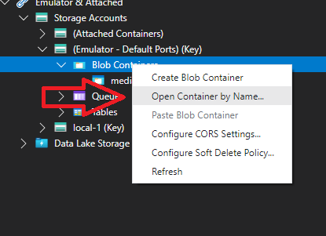

# Job Opportunities .Net6 + Angular

## Setup

Set both projects (API and SPA) as startup projects


If you want to use Serilog:

1) Install Windows Azure Storage Emulator

2) Run:

```bash
    AzureStorageEmulator.exe start
```

3) set:

```json
    "AuditLogs": {
    "Enabled": true}
```

in appsettings.json

## Steps to set up the database

1) update-database

## Steps to update the database

1) add-migration \<MigrationName\> -Project JobOpportunities.Data -StartupProject JobOpportunities.API
2) update-database

## Technologies

* .Net 6
* EF Core
* Moq
* NUnit
* MediatR
* FluentValidations
* FluentAssertions
* Angular 13
* Angular Material
* [Audit.NET](https://github.com/thepirat000/Audit.NET)
* AzureStorageBlobs (Audit.NET.AzureStorageBlobs)
* Serilog
* Rabbitmq

## Layers

### API

(In Progress)

### Data

EFCore 6 (Sql Server)

Generic Repository


### Core

Audit.NET: Track only commands with [AuditLog] attribute.

Auth: Access token + Refresh tokens

### Domain

(In Progress)


## Features

### Log

To open local storage in azure storage explorer and avoid problems:



search "mediatr".

---

Audit.NET loguea solo commands en Azure Storage. Ver de tener AuditLogs:Enabled en el appSettings y el emulador de azure storage local corriendo.
Se crea un blob container por día con formato: "mediatrcommandlogs{DateTime.Today:yyyyMMdd}"
Y luego un registro en formato json por cada command con el formato: "{ev.EventType}/{currentUser?.Id}_{DateTime.UtcNow.Ticks}.json"

Serilog está en la pipeline de MediatR y hace un log de cada request con el siguiente formato:
{RequetsName}: {@User} with request {@Request}

Hay un custom logger puesto en un middleware que mide tiempo de respuestas de cada endpoint

## Queues and workers

### Enable RabbitMQ Management Plugin

Go to the directory where the RabbitMQ is installed.

Now, enable the rabbitmq_management plugin using the rabbitmq-plugins command as shown below.

```bash
sbin/rabbitmq-plugins enable rabbitmq_management
```

After enabling the rabbitmq_management plugin you should restart the RabbitMQ server as shown below.

```bash
sbin/rabbitmqctl stop

sbin/rabbitmq-server -detached
```

By default the management plugin runs on 15672 HTTP port.

From your browser go to <http://localhost:15672>

The default username and password for RabbitMQ management plugin is: **guest**

## Resources

:bulb: **Notice:** Some resources are in Spanish

### Inspired by

* [CleanArchitecture](https://github.com/jasontaylordev/CleanArchitecture) by Jason Taylor
* [Minimal API Vertical Slice Architecture](https://github.com/isaacOjeda/MinimalApiArchitecture) by Isaac Ojeda
* [C# 9 Generics](https://app.pluralsight.com/library/courses/c-sharp-generics/table-of-contents) by Thomas Claudius Huber
* [Code C# like a pro](https://www.oreilly.com/library/view/code-like-a/9781617298028/) by Jort Rodenburg
* [Angular 13 Fundamentals](https://frontendmasters.com/courses/angular-13/) by Lukas Ruebbelke
* [Angular dark mode](https://zoaibkhan.com/blog/angular-material-dark-mode-in-3-steps) by Zoaib Khan
* [JWT Authentication](https://www.codemag.com/Article/2105051/Implementing-JWT-Authentication-in-ASP.NET-Core-5) by Joydip Kanjilal
* [RabbitMQ tutorials](https://www.rabbitmq.com/tutorials/tutorial-one-dotnet.html)
* [rabbitmq data serialisation](https://dotnetcodr.com/2014/06/05/rabbitmq-in-net-data-serialisation/) by Andras Nemes
* [Graphql doc](https://graphql-dotnet.github.io/docs)
* [Net 5 api with graphql](https://dev.to/moe23/net-5-api-with-graphql-step-by-step-2b20) by Mohamad Lawand
* [Using dapper with asp net](https://code-maze.com/using-dapper-with-asp-net-core-web-api/) by Marinko Spasojevic
  
### Pending

* [MediaRBehaviors](https://github.com/jbogard/MediatR/wiki/Behaviors) by Jimmy Bogard
* [HashIds](https://medium.com/@patrickfav/a-better-way-to-protect-your-database-ids-a33fa9867552) by Patrick Favre-Bulle
* [UUIDs](https://medium.com/lightrail/prevent-business-intelligence-leaks-by-using-uuids-instead-of-database-ids-on-urls-and-in-apis-17f15669fd2e) by [Peter Locke](https://medium.com/@pdlocke)

### Work in progress

* [Convert C# classes to TS interfaces](https://www.freecodecamp.org/news/the-easy-way-to-get-typescript-interfaces-from-c-java-or-python-code-in-any-ide-c3acac1e366a/) by Leonardo Carreiro

### References

* [CQRS](https://garywoodfine.com/what-is-cqrs/) by Gary Woodfine
* [ASP.NET + rabbitmq](https://hamedfathi.me/a-professional-asp.net-core-api-rabbitmq/)
* [Ways to do DI](https://www.c-sharpcorner.com/article/basics-of-di/)

### To read

* [Middleware vs Filters](https://www.thetechplatform.com/post/middleware-and-filters-power-in-asp-net-core)
* [Interesting article about extension methods](https://weblogs.asp.net/scottgu/new-orcas-language-feature-extension-methods)
* [OpenID (OpenID Connect (OIDC)), OAuth 2.0](https://dev.to/isaacojeda/aspnet-core-servidor-de-autenticacion-con-openid-connect-59kh)
* [Dapper Migrations with Fluentmigrator in Aspnetcore](https://code-maze.com/dapper-migrations-fluentmigrator-aspnetcore/)
* [Error Handling](https://code-maze.com/global-error-handling-aspnetcore/)
* [GUID as clustering key](https://stackoverflow.com/questions/20463798/uniqueidentifier-vs-identity-vs-material-code-which-is-the-best-choice-for-p)
* [Async comm between Net MS and Rabbitmq](https://www.c-sharpcorner.com/article/asynchronous-communication-between-microservices-using-net-core-api-rabbitmq/)

### To watch

[](https://www.youtube.com/watch?v=bnVfrd3lRv8)

### Tools

[DBeaver](https://dbeaver.io/)
[Mediatr Service Template](https://github.com/timdows/MediatRTemplate)
