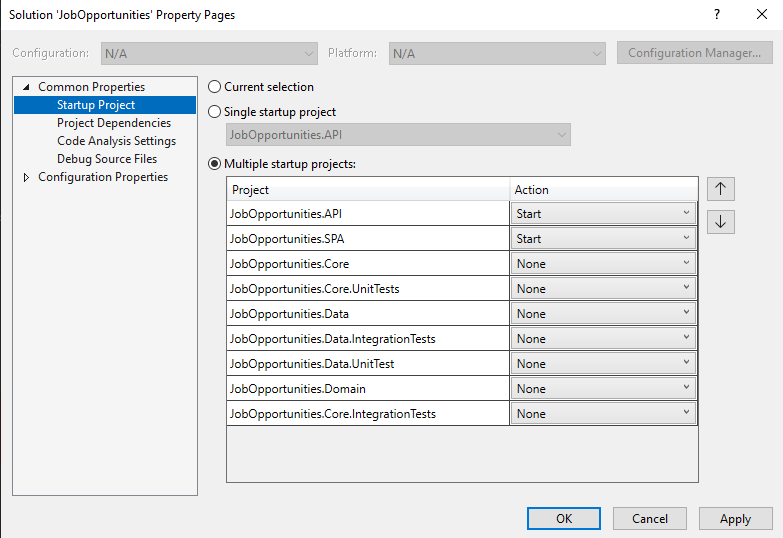

# Job Opportunities .Net6 + Angular

## Setup

Set both projects (API and SPA) as startup projects

## Steps to set up the database

1) update-database

## Steps to update the database

1) add-migration \<MigrationName\> -Project JobOpportunities.Data -StartupProject JobOpportunities.API
2) update-database

## Technologies

* .Net 6
* EF Core
* Moq
* NUnit
* MediatR
* FluentValidations
* FluentAssertions
* Angular 13
* Angular Material

## Layers

### API

(In Progress)

### Data

EFCore 6 (Sql Server)

Generic Repository

### Core

### Domain

(In Progress)

## Resources

### Inspired by

* [CleanArchitecture](https://github.com/jasontaylordev/CleanArchitecture) by Jason Taylor
* [Minimal API Vertical Slice Architecture](https://github.com/isaacOjeda/MinimalApiArchitecture) by Isaac Ojeda
* [C# 9 Generics](https://app.pluralsight.com/library/courses/c-sharp-generics/table-of-contents) by Thomas Claudius Huber
* [Code C# like a pro](https://www.oreilly.com/library/view/code-like-a/9781617298028/) by Jort Rodenburg
* [Angular 13 Fundamentals](https://frontendmasters.com/courses/angular-13/) by Lukas Ruebbelke
* [Angular dark mode](https://zoaibkhan.com/blog/angular-material-dark-mode-in-3-steps) by Zoaib Khan
* [JWT Authentication](https://www.codemag.com/Article/2105051/Implementing-JWT-Authentication-in-ASP.NET-Core-5) by Joydip Kanjilal
  
### Pending

* [MediaRBehaviors](https://github.com/jbogard/MediatR/wiki/Behaviors) by Jimmy Bogard
* [HashIds](https://medium.com/@patrickfav/a-better-way-to-protect-your-database-ids-a33fa9867552) by Patrick Favre-Bulle
* [UUIDs](https://medium.com/lightrail/prevent-business-intelligence-leaks-by-using-uuids-instead-of-database-ids-on-urls-and-in-apis-17f15669fd2e) by [Peter Locke](https://medium.com/@pdlocke)

### Work in progress

* [Convert C# classes to TS interfaces](https://www.freecodecamp.org/news/the-easy-way-to-get-typescript-interfaces-from-c-java-or-python-code-in-any-ide-c3acac1e366a/) by Leonardo Carreiro

### References

* [CQRS](https://garywoodfine.com/what-is-cqrs/) by Gary Woodfine

### To read

* [Middleware vs Filters](https://www.thetechplatform.com/post/middleware-and-filters-power-in-asp-net-core)
* [Interesting article about extension methods](https://weblogs.asp.net/scottgu/new-orcas-language-feature-extension-methods)
