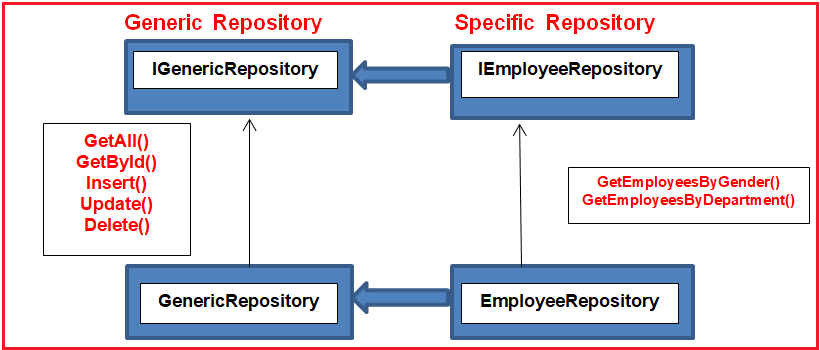
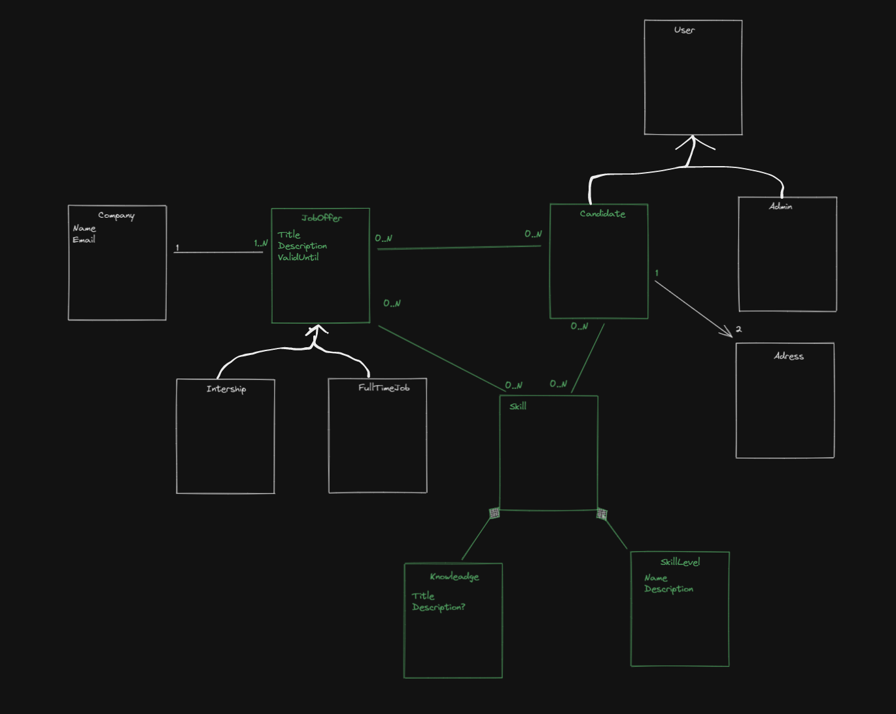

# Job Opportunities .Net6 + Angular

## Steps to set up the database

1) update-database

## Steps to update the database

1) add-migration <MigrationName> -Project JobOpportunities.Data
2) update-database

## Technologies
* .Net 6
* EF Core
* Moq
* NUnit
* MediatR
* FluentValidations
* FluentAssertions

# Layers

## API
(In Progress)

## Data
EFCore 6 (Sql Server)

Generic Repository

## Core

## Domain

(In Progress)

## Inspired by:

- [CleanArchitecture](https://github.com/jasontaylordev/CleanArchitecture) by Jason Taylor
- [Minimal API Vertical Slice Architecture](https://github.com/isaacOjeda/MinimalApiArchitecture) by Isaac Ojeda
- [C# 9 Generics](https://app.pluralsight.com/library/courses/c-sharp-generics/table-of-contents) by Thomas Claudius Huber
- [Code C# like a pro](https://www.oreilly.com/library/view/code-like-a/9781617298028/) by Jort Rodenburg
- [Angular 13 Fundamentals](https://frontendmasters.com/courses/angular-13/) by Lukas Ruebbelke
  
## Pending:
- [MediaRBehaviors](https://github.com/jbogard/MediatR/wiki/Behaviors) by Jimmy Bogard
- [HashIds](https://medium.com/@patrickfav/a-better-way-to-protect-your-database-ids-a33fa9867552) by Patrick Favre-Bulle
- [UUIDs](https://medium.com/lightrail/prevent-business-intelligence-leaks-by-using-uuids-instead-of-database-ids-on-urls-and-in-apis-17f15669fd2e) by [Peter Locke](https://medium.com/@pdlocke)

## Work in progress

- [Convert C# classes to TS interfaces](https://www.freecodecamp.org/news/the-easy-way-to-get-typescript-interfaces-from-c-java-or-python-code-in-any-ide-c3acac1e366a/